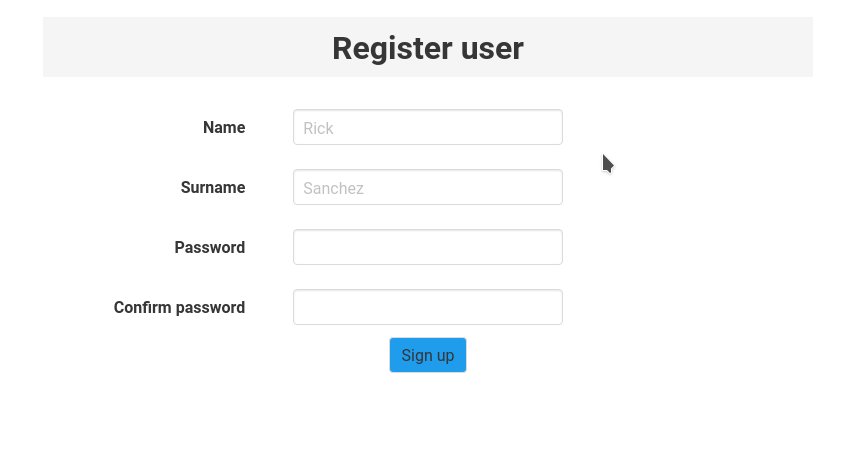

# Example of using [Validatex](https://github.com/iodevs/validatex) library



## Install mix and node dependencies

```
mix setup
```

## Start your Phoenix server:

```
mix phx.server
```

Now you can visit [`localhost:4000`](http://localhost:4000) from your browser.
